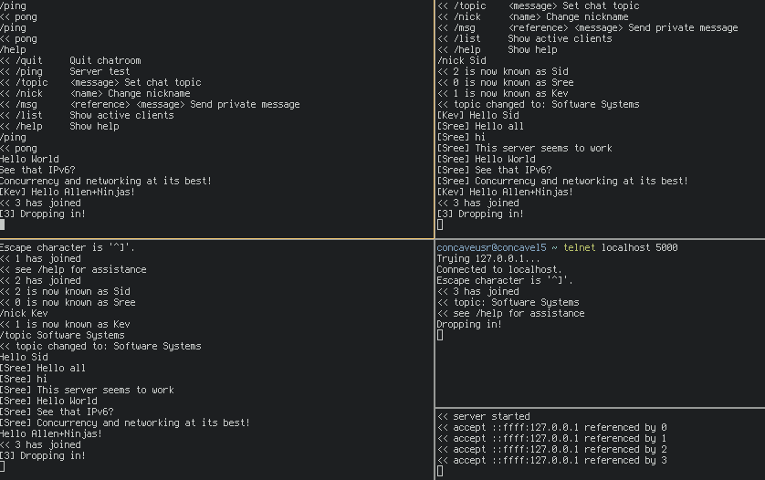

## Exploring Networks bia IRC and Hamming Codes
Sreekanth Sajjala, Kawin Nikomborirak, Siddharth Garimella

### Project Goals
The goal is to explore network programming via a client-server application as well as implement a physical layer using LEDs and Hamming codes.

## Learning Goals
We want to learn about networking in C at multiple levels of abstraction.
By building an IRC server, we will learn about network programming and the use of sockets in C.
This level of abstraction focuses on the protocol behind IRC, and black-boxes many of the actual data transfer algorithms involved.
To understand more about this part of networking in C, we’re implementing a light-based, error controlled data transfer channel, which we’ll intentionally introduce some noise to for the purpose of simulating noisy light conditions during the transfer process.

### Deliverables

#### IRC Server/Client
Rather than make a server/client, for the purpose of demos as well as avoiding making this an API design project, we put all of the functionality in the server and made the client telnet, as shown in the picture below.



We have successfully implemented a chat room with commands to change nicknames and topics as well as a PM feature.
The server is handled procedural in a while loop with a few variables held in the stack.
Alongside the boilerplate sockets, the required server side variables are the following:

``` c
/** Keep track of the amount of clients */
extern int cli_count;

/** Keep track of the latest uid */
extern unsigned int uid;

/** Keep track of the topic in use */
extern char topic[];

/** A buffer containing the clients */
Client *clients[MAX_CLIENTS];
```

When a client created via an established connection, a function called `queue_add` adds a client to the client buffer and increments `cli_count`.
When a client is removed via the `/quit` command, a function called `queue_delete` frees the client and decrements `cli_count`.
The structure contains a socket, file descriptor, a unique id for each client, and a name to be set by the user.
The `Client` struct is the structure which keeps track of a connected client, which is shown below.

```
/**
   The structure used to describe a client.
   It comprises of a socket address, a file descriptor, a unique
   identifier, and a name.
 */
typedef struct {
  struct sockaddr_in6 *addr;
  int connfd;
  unsigned int uid;
  char name[MAX_NAME_SZ];
} Client;
```

The address of the client is an IPv6 address, and there is an associated file descriptor for reading and writing, a user id which is a number, and a user name which can be set with the `/nick` command similar to actual IRC syntax.

The server is concurrent with a mutex for the handling of clients as well as a mutex for the changing of the current topic.

Using [Beej’s guide](https://beej.us/guide/bgnet/) to network programming for reference, we are using send() and recv() in lieu of write() and read() to get into the habit of using more powerful networking tools.
All commands with 

#### Physical Layer
