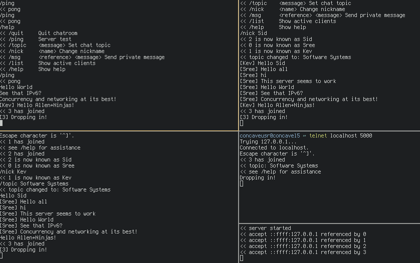

## Exploring Networks via IRC and Hamming Codes
Sreekanth Sajjala, Kawin Nikomborirak, Siddharth Garimella

### Project Goals
The goal is to explore network programming via a client-server application as well as implement a physical layer using LEDs and Hamming codes.

## Learning Goals
We want to learn about networking in C at multiple levels of abstraction.
By building an IRC server, we will learn about network programming and the use of sockets in C.
This level of abstraction focuses on the protocol behind IRC, and black-boxes many of the actual data transfer algorithms involved.
To understand more about this part of networking in C, we’re implementing a light-based, error controlled data transfer channel, which we’ll intentionally introduce some noise to for the purpose of simulating noisy light conditions during the transfer process.


### Resources: 
 - Class materials from Computer Networks
 - https://en.wikibooks.org/wiki/C_Programming/Networking_in_UNIX
 - This explanation of sockets with example code: https://www.geeksforgeeks.org/tcp-server-client-implementation-in-c/
 - Information on IRC protocol: https://tools.ietf.org/html/rfc1459
 - This useful guide to modern network programming: https://beej.us/guide/bgnet/
 - Discrete Mathematics class material

### Deliverables

#### IRC Server/Client
Rather than make a server/client, for the purpose of demos as well as avoiding making this an API design project, we put all of the functionality in the server and made the client telnet, as shown in the picture below.



We have successfully implemented a chat room with commands to change nicknames and topics as well as a PM feature.
The server is handled procedural in a while loop with a few variables held in the stack.
Alongside the boilerplate sockets, the required server side variables are the following:

``` c
/** Keep track of the amount of clients */
extern int cli_count;

/** Keep track of the latest uid */
extern unsigned int uid;

/** Keep track of the topic in use */
extern char topic[];

/** A buffer containing the clients */
Client *clients[MAX_CLIENTS];
```

When a client created via an established connection, a function called `queue_add` adds a client to the client buffer and increments `cli_count`.
When a client is removed via the `/quit` command, a function called `queue_delete` frees the client and decrements `cli_count`.
The structure contains a socket, file descriptor, a unique id for each client, and a name to be set by the user.
The `Client` struct is the structure which keeps track of a connected client, which is shown below.

```
/**
   The structure used to describe a client.
   It comprises of a socket address, a file descriptor, a unique
   identifier, and a name.
 */
typedef struct {
  struct sockaddr_in6 *addr;
  int connfd;
  unsigned int uid;
  char name[MAX_NAME_SZ];
} Client;
```

The address of the client is an IPv6 address, and there is an associated file descriptor for reading and writing, a user id which is a number, and a user name which can be set with the `/nick` command similar to actual IRC syntax.

The server is concurrent with a mutex for the handling of clients as well as a mutex for the changing of the current topic.

Using [Beej’s guide](https://beej.us/guide/bgnet/) to network programming for reference, we are using send() and recv() in lieu of write() and read() to get into the habit of using more powerful networking tools.
Since we want to be able to demo the chatroom in class with no overhead for participants, we will be using telnet as a client and have all other interactions handled by the server.

#### Data encoding

The message was first converted to a bit string representation for transmission using an LED. Then, it is split up into words. Each word is processed a character at a time, providing a bit string of length 8 to the Hamming encoder.

```
    // converts token to bitstring representing byte
    for (int i = 7; i >= 0; i--) {
      data[7 - i] = (token >> i) & 1 ? 1 : 0;
    }

    int nybble1[4];
    int nybble2[4];
    int *codenybble1;
    int *codenybble2;
    
    // splitting the byte into two nybbles
    for (int i = 0; i < 8; i++) {
      if (i < 4) {
        nybble1[i] = data[i];
      } else {
        nybble2[i - 4] = data[i];
      }
    }
```

The Hamming encoder gets the bit string and breaks it up into two nibbles. Each nibble, now of length 4, is then assigned 3 parity bits. The parity bits are decided based on the linear coding scheme used (Hamming code). 

The parity bits are then appended to each nibble, resulting in a bit string of length 7. The encoded message data is now ready to be sent via the channel. With the addition of these bits, errors in the codeword (nibble + parity bits) can be caught, and even corrected. The hamming code used here is capable of catching up to two errors and correcting one (where an error is 0 switching to a 1 or vice-versa).

```
void correct_codeword(int *codeword) {
  // using parity bits in encoded 
  int c1 = codeword[6] ^ codeword[4] ^ codeword[2] ^ codeword[0];
  int c2 = codeword[5] ^ codeword[4] ^ codeword[1] ^ codeword[0];
  int c3 = codeword[3] ^ codeword[2] ^ codeword[1] ^ codeword[0];
  int c = c3 * 4 + c2 * 2 + c1;
  
  // c can provide information on where the error was detected in the codeword
  if (c == 0) {
    puts("\nNO ERROR DETECTED.");
  } else {
    if (codeword[7 - c] == 0) {
      codeword[7 - c] = 1;
    } else {
      codeword[7 - c] = 0;
    }
    puts("\nERROR CORRECTED");
  }
}
```

For decoding, partial messages are simply extracted from each nybble, and joined to represent the bitstring of the original letter. 


#### Physical Layer: Light transmission 

We decided to use 2 Raspberry Pi's, an LED, and a photoresistor setup to transmit data through light. We passed data nibbles at a time between Pi's using morse code via the LED and photoresistor. We used the hamming code scripton both the sending and receiving ends to encode and decode the data. We then introduced some noise and repeated the process, verifying that the data arrived with some errors, but that many were caught and corrected for.


Example transmission: The quick brown fox jumps over the lazy dog

Received: The quick brown fox jumps over thl lazyPdog

Caught errors: 
```
[T:[] []', h:[] [], e:[] [],  :[] [4], q:[] [], u:[] [], i:[] [], c:[] [0], k:[] [],  :[5] [], b:[] [], r:[] [5], o:[] [3], w:[] [4], n:[] [],  :[4] [1], f:[] [], o:[] [], x:[3] [],  :[] [], j:[] [], u:[2] [], m:[] [], p:[] [], s:[] [],  :[] [], o:[] [1], v:[] [], e:[] [], r:[] [],  :[] [0], t:[5] [0], h:[] [], e:[] [3, 4],  :[] [], l:[] [], a:[] [], z:[] [], y:[] [],  :[1, 2] [], d:[2] [], o:[] [], g:[] []']
```

For each character, information about each error detected appears in the full output. The locations of errors in each error-corrected nibble appears beside the letter of the original message. 

## Reflection

The learning goals of this project was to understand networking better in C. We accomplished this by implementing two different network layers. We were able to understand the transport layer of the internet by using sockets and running an application layer via a client.
We also successfully implemented an error checking physical layer using light transmission between two Raspberry Pi's and hamming codes.
We were also able to stretch ourselves and add some nice client-side features such as help, ping, and direct messaging.
Throwing all of this together in a bug-free application exceeded our first hopes for the project.
Ultimately, our work on this project has improved our knowledge about how networks are implemented in C and has increased our confidence in our ability to develop network-related programs.

Trello board: https://trello.com/b/i9AXutYA/irsea

Presentation: https://docs.google.com/presentation/d/1WHuvyTm3Z8Dq3_qSc0JJRP-h1rK6UXx92n0Vjv86hLY/edit?usp=sharing
