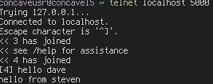

## Exploring networks via IRC and hamming codes

Sreekanth Sajjala, Kawin Nikomborirak, Siddharth Garimella

### The Final Goal

The initial goal was to explore network programming via a client-server application, hence the original MVP of making an IRC server/client clone. A stretch goal is to explore the lower levels of the network stack such as the physical layer to obtain a deep understanding of computer networks.

### What We’ll Learn

We want to learn about networking in C at multiple levels of abstraction. By building an IRC server, we will learn about network programming and the use of sockets in C. This level of abstraction focuses on the protocol behind IRC, and black-boxes many of the actual data transfer algorithms involved. To understand more about this part of networking in C, we’re implementing a light-based, error controlled data transfer channel, which we’ll intentionally introduce some noise to for the purpose of simulating noisy light conditions during the transfer process.

### Steps thus far

We have gone through resources from Alex Morrow’s computer networks class, Byran Hall’s Beej’s Guide to Network Programming and content from discrete math. 

We have set up a communication channel between 2 raspberry pis where one uses an LED to transmit while the other uses a photoresistor to receive. We have written code in python to detect and translate dots, dashes and spaces. We are now working to integrate hamming code error checking into this data transmission.

On the IRC server side, we have successfully implemented a chat room with commands to change nicknames and topics as well as a PM feature. Currently, telnet is the client to the server and the setup works with few bugs. Using Beej’s guide to network programming for reference, we are using send() and recv() in lieu of write() and read() to get into the habit of using more powerful networking tools. The server also leverages IPV6 for those trillion trillion addresses out there. Current bugs is that displaying nicknames before the message display mangles output, and a sent message overwrites the input box. The server is concurrent with a mutex for the handling of clients as well as a mutex for the changing of the current topic. The clients are stored in an array of pointers and deletion of a client is done by setting an element to NULL. An example chat is below:

For error-control, we’ve implemented a [7,4] Hamming code, capable of correcting any single-bit errors and catching all single-bit and up to two-bit errors. The algorithm is designed to operate on a given string of any length, and works by splitting the string up into individual characters, then turning each character into a bit string of length 8. Each bit string is then broken up into two nybbles. Each nybble then gets three parity bits, and is output as a bit string of length 7. Special characters will be used to separate pairs of error corrected bitstrings, so each pair can be found and processed together to re-form a character. The special character between each pair of corrected nybbles, however, will not be error corrected for, so we either assume the special character is immune to the noisiness of the channel we are transferring through, or we guarantee no output character with a single bit error to be incorrect (and are okay with occasionally missed characters). Either way, what matters to us is that the functionality error control mechanism is not lost on the semantics of its integration with the chat platform (i.e. this is a solved problem).
 
### What comes next

Minus a few bugs, we have attained our MVP as well as a functioning physical layer implemented with LEDs and a raspberry pi tested with the “hello world” string.

We are integrating the hamming code error checking with the transmission of data between raspberry pis using an LED and a Photoresistor.

We are currently perfecting Nibble control. Only the highest quality nipples will be allowed to be transmitted through light and ANY errors will be corrected.

The IRC server is getting cleaned from minor bugs, including making nicknames work. A stretch goal is properly freeing up all structures used in the program. A non-telnet client is also in the making.

We are all working on the above projects using peer-programming.

Trello: https://trello.com/b/i9AXutYA/irsea
Github: https://github.com/concavegit/ir-sea/edit/master/

